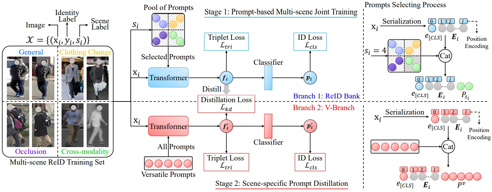

# VersReID
Official implementation of Paper ''A Versatile Framework for Multi-scene Person Re-identification''.


## News
2024/4/3: The v-branch model checkpoint is released at [Baidu Drive](https://pan.baidu.com/s/190e1vHzYUry9LTivNiWM5Q?pwd=pami) and [Google Drive](https://drive.google.com/file/d/14Kb34AXy18PucHNxvwxvbsE1dUOdUDIT/view?usp=sharing)

2024/3/19: Our arxiv paper can be found [here](https://arxiv.org/abs/2403.11121)

2024/3/16: Code and Pre-trained model are released. Check [Baidu Drive](https://pan.baidu.com/s/1TopJ37U9ZlmxQ2-HyP9kqw?pwd=pami) and [Google Drive](https://drive.google.com/file/d/1D-9sGqlNtZSolTgVY0yPamW3sHhzyIc4/view?usp=sharing) for the pre-trained model


## Datasets
Please visit the following link to download the dataset.
- [Market-1501](https://www.kaggle.com/datasets/pengcw1/market-1501/data) 
- [MSMT17](http://www.pkuvmc.com/dataset.html) 
- MLR-CUHK03: [Baidu Drive](https://pan.baidu.com/s/1hMQZq0LAPhIl5RQ_EDDiFg?pwd=pami), [Google Drive](https://drive.google.com/file/d/1UQjJ2PLO4FTnLAgF16ZsSkBPaSehIw_G/view?usp=sharing)
- [Cele-ReID](https://github.com/Huang-3/Celeb-reID)
- [PRCC](https://www.isee-ai.cn/%7Eyangqize/clothing.html)
- [Occ-Duke](https://github.com/lightas/Occluded-DukeMTMC-Dataset)
- [SYSU-mm01](https://www.isee-ai.cn/project/RGBIRReID.html)

Once you download the datasets, make sure to modify the dataset's root manually [here](https://github.com/iSEE-Laboratory/VersReID/blob/main/configs/ReID-Bank.yml#L55) and [here](https://github.com/iSEE-Laboratory/VersReID/blob/main/configs/V-Branch.yml#L58). 

## Environments
Please follow [TransReID](https://github.com/damo-cv/TransReID) to configure the running environment. 

We provide our used package list in [full-environment.txt](https://github.com/iSEE-Laboratory/VersReID/blob/main/full-environment.txt) for a reference.


## Run
- Download the pre-trained model at [Baidu Drive](https://pan.baidu.com/s/1TopJ37U9ZlmxQ2-HyP9kqw?pwd=pami) or [Google Drive](https://drive.google.com/file/d/1D-9sGqlNtZSolTgVY0yPamW3sHhzyIc4/view?usp=sharing).

- Create a directory named ckpts and then put the downloaded model into it, or you can modify the MODEL.PRETRAIN_PATH in ```./bash/run_VersReID.sh``` to your own pre-trained model path.

- To reproduce the results in our paper, just simply run this script:
```
bash ./bash/run_VersReID.sh
```
You can modify the configs by yourself to explore more settings.

__Note__: Training the ReID-Bank requires ~20G GPU Memory, V-Branch requires ~30G GPU Memory. We highly recommend use cuda 10.2 for better reproducibility. Moreover, the code does not support multi-GPU training currently. 

- To test the provided v-branch checkpoint, you can download the checkpoint at [Baidu Drive](https://pan.baidu.com/s/190e1vHzYUry9LTivNiWM5Q?pwd=pami) or [Google Drive](https://drive.google.com/file/d/14Kb34AXy18PucHNxvwxvbsE1dUOdUDIT/view?usp=sharing) and run the below script:
```
python multi_scene_single_test.py --config_file configs/V-Branch.yml MODEL.DEVICE_ID "('0')" \
  MODEL.PRETRAIN_CHOICE none \
  TEST.WEIGHT /path/to/v-branch.pth \
  MODEL.AUX_LOSS True \
  OUTPUT_DIR logs/V-Branch/

python multi_scene_joint_test.py --config_file configs/V-Branch.yml MODEL.DEVICE_ID "('0')" \
  MODEL.PRETRAIN_CHOICE none \
  TEST.WEIGHT /path/to/v-branch.pth \
  MODEL.AUX_LOSS True \
  OUTPUT_DIR logs/V-Branch/
```

If you have any problem, feel free to open an issue or contact me :-)

## Acknowledgement
- This repository is heavily based on [TransReID](https://github.com/damo-cv/TransReID), many thanks to the authors.

- If you find this repo helpful, please consider citing us:
``` bibtex
@article{zheng2024versreid,
  title = {A Versatile Framework for Multi-scene Person Re-identification},
  author = {Zheng, Wei-Shi and Yan, Junkai and Peng, Yi-Xing},
  journal = {IEEE Transactions on Pattern Analysis and Machine Intelligence},
  year = {2024}
}
```
